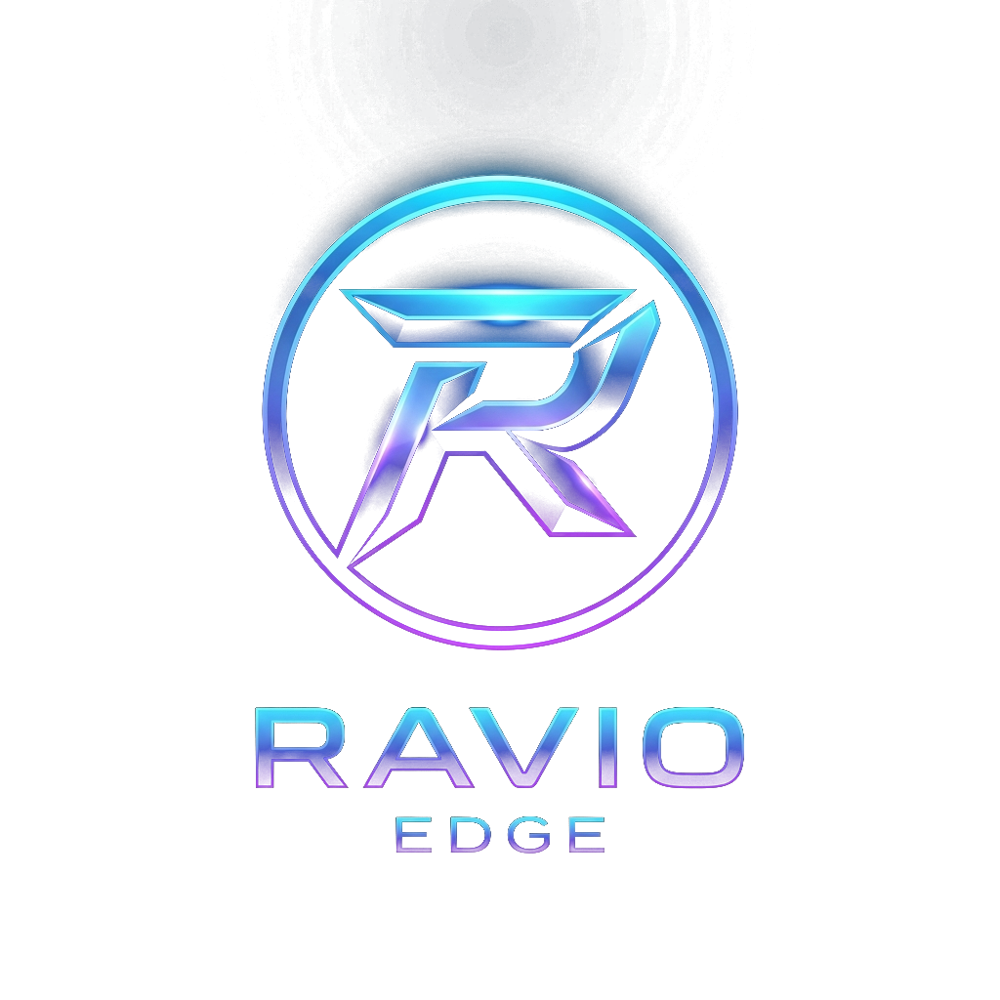

<div align="center">
  

<div align="center">

---

 >*We are all living in a simulation*

---

</div>
  
  # Ravio Edge: Quantitative Trading Terminal

  **An AI-Powered, Glassmorphic Market Analysis Dashboard & Snapshot Extension**

  [](https://nextjs.org/)
  [](https://ai.google.dev/)
  [](https://chrome.google.com)
</div>

<br />

## 🚀 The Purpose
Ravio Edge is a high-performance, ultra-modern trading terminal designed specifically for Nifty 50 and Bank Nifty options traders. Instead of relying purely on static indicators, Ravio Edge utilizes **Google's Gemini Multimodal AI** to visually "read" live charts and option chains just like a human trader would. 

By combining technical indicators (VWAP, EMAs, SMA), institutional FII/DII data, and real-time geopolitical news, it generates highly structured, instant insights. Designed with a stunning "Extreme Glassmorphism" UI, it provides scalpers and intraday traders with definitive directional bias, specific support/resistance zones, and premium-based entry/exit targets.

---

## 🛠️ Project Architecture

This repository contains two interconnected modules:
1. **`RavioEdge/`**: The core Next.js web application and AI engine.
2. **`RavioSnap-Extension/`**: A custom Google Chrome extension that automates the capturing of live charts and beams them directly into the dashboard.

---

## ⚙️ How to Setup & Run

### Part 1: Setting up the Ravio Edge Dashboard

1. **Clone the Repository:**
   ```bash
   git clone https://github.com/ravii-k/Ravio-Edge.git
   cd Ravio-Edge/RavioEdge
   ```

2. **Install Dependencies:**
   ```bash
   npm install
   ```

3. **Configure your API Key:**
   To use the AI vision capabilities, you need a free Google Gemini API key.
   - Go to [Google AI Studio](https://aistudio.google.com/app/apikey) and generate an API key.
   - In the `RavioEdge` folder, rename the `.env.example` file to `.env.local`.
   - Open `.env.local` and paste your key:
     ```env
     GEMINI_API_KEY=your_actual_api_key_here
     ```

4. **Start the Local Server:**
   ```bash
   npm run dev
   ```
   *The dashboard will now be running on `http://localhost:3000`.*

---

### Part 2: Installing the RavioSnap Extension

The extension allows you to bypass manual screenshotting. It automatically grabs your live charts and option chains and sends them to the dashboard.

1. Open Google Chrome and navigate to `chrome://extensions/`.
2. Toggle **Developer mode** ON (top right corner).
3. Click **Load unpacked** and select the `RavioSnap-Extension` folder from this repository.
4. Pin the **RavioSnap-Extension** icon to your browser toolbar.

---

## 📸 Customizing the Screenshot Targets

By default, the extension is programmed to look for specific broker tabs:
- **Nifty 50 Chart:** Looks for TradingView URLs containing `NSE%3ANIFTY` or `nifty50`.
- **Bank Nifty Chart:** Looks for TradingView URLs containing `NSE%3ABANKNIFTY`.
- **Option Chain:** Looks for Dhan's TV platform (`tv.dhan.co`) or URLs containing `option-chain`.

### How to change the target URLs to fit your broker:
If you use a different broker (like Zerodha, Groww, or Upstox), you can easily modify the extension to capture your specific tabs:
1. Open `RavioSnap-Extension/background.js`.
2. Locate the tab finding logic at the top of the `runCaptureSequence()` function:
   ```javascript
   let niftyTab = tabs.find(t => { ... });
   let bankNiftyTab = tabs.find(t => { ... });
   let optionChainTab = tabs.find(t => { ... });
   ```
3. Update the `.includes('your-broker-url')` strings to match the exact URLs or tab titles of your preferred broker.
4. Go back to `chrome://extensions/` and click the circular **Reload** icon on the RavioSnap card to apply your changes.

---

## 🧠 Customizing the AI Trading Strategy

The AI is currently engineered to behave as an **Intraday Scalper** (providing premium-based targets, VWAP/EMA interpretations, and strict Stop Losses). If you have a different trading style (e.g., Swing Trading, Option Selling/Writing, or purely Price Action based), you can rewrite the AI's core instructions.

### How to change the AI Prompts:
1. Open `RavioEdge/app/api/analyze/route.ts` in your code editor.
2. Scroll down to the `prompt +=` sections (around line 150+).
3. Here, you will find the distinct instructions for `current`, `pre`, and `post` market modes. 
4. Simply rewrite the text! For example, you can tell the AI to:
   - *"Act as an Option Writer and focus on Theta decay."*
   - *"Analyze the charts using only Fibonacci retracements."*
   - *"Focus on Swing trading with 3-day hold targets."*
5. Save the file, and the AI will immediately adopt your new trading personality on the next run.

---

## 📊 The Three Market Modes

Ravio Edge is split into three distinct operational modes to cover the entire trading day:

1. **Pre Market:** Designed to predict the market opening behavior (Gap Up/Down/Flat) and suggest strategies for the first 30 minutes of trade.
2. **Current Market (Live):** Built for live intraday scalping using live chart/option chain screenshots via the RavioSnap Extension.
3. **Post Market:** Summarizes the day's price action and predicts the sentiment for tomorrow based on closing data and overnight US action.

### 📝 Manual Data Entry (For Pre & Post Market)
While the **Current Market** tab relies heavily on automatic screenshots, the **Pre Market** and **Post Market** tabs require some manual data entry to feed the AI institutional context. 

When using Pre or Post market modes, you must manually input:
1. **GIFT Nifty Data:** The current price and change percentages.
2. **5-Day FII/DII Activity:** The net institutional flow (in ₹ Cr) for FII Cash, FII Futures, DII Cash, and FII Options over the last 5 trading sessions. *(The dates will auto-populate skipping weekends).*

---

## ⚡ How to Use the Terminal

1. **Prepare your workspace:** Open your three broker tabs (Nifty, Bank Nifty, Option Chain) and keep them fully loaded in Chrome.
2. **Open the Dashboard:** Keep `http://localhost:3000` open in a fourth tab.
3. **One-Click Analysis:** Make sure you are on the "Current Market" tab in the dashboard. Click the RavioSnap Extension icon in your Chrome toolbar and hit **Capture & Analyze**.
4. **Result:** The extension will instantly cycle through your tabs, capture the screenshots, inject them into the dashboard, and automatically trigger the AI engine. Within seconds, you will receive your scalping targets, market bias, and S&R zones!

<br />

---

## 🗺️ Whats Next? (Future Roadmap)

I build this mainly for my own personal scalping but there is so much more we can do with this architecure. Here are a few things im planing to implement in the future:

- **Full Brocker API Integration:** Right now it gives you the exact premium target and SL, but you have to punch it in manually. Next step is to hook it up to Dhan or Zerodha API so a "1-Click Trade" button appears on the dashbord to auto-execute.
- **Multi-Timefram Confluence:** Scalping needs multiple timeframes. Im planning to update the extension so it grabs the 1-min, 5-min, and 15-min charts all at the same time and sends them to Gemini for better accuracy.
- **Voice Alerts:** taking your eyes off the chart to read the anlysis is annoying. Im gonna add a text to speech feature so the terminal literally speaks the entry, target and stoploss right into your headphones in real-time.
- **Automous Mode:** Instead of clicking the extension button, a background worker will run on websockets and auto-screenshot the charts every 3 mins and only alert you if a good setup is forming.
- **Backtesting DB:** Wanna add a database to save every prediction and compare it with end of day charts to see how accuate the AI really is and tweak the promts. 

Feel free to fork the repo and add any of these features if you want!

<br />

---
## 👨‍💻 Author

**Ravi Kashyap**
- GitHub: [@Ravionite](https://github.com/ravii-k)

---

> Built with ❤️
